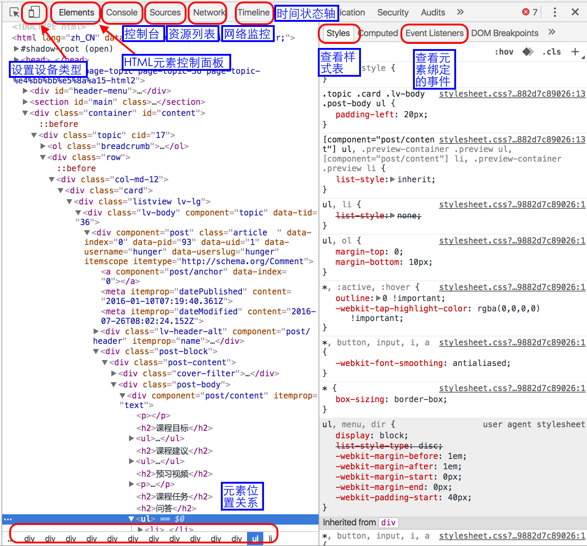

> 课程目标
> - 掌握样式的几种引入方式
> - 能使用Chrome开发工具进行基本页面调试
> - 熟悉常见文本样式
> - 熟悉单位的使用

# 问答

## 样式有几种引入方式？link 和 @import 有什么区别？

- 浏览器缺省设置：默认设置
- 外部样式表：`<link ref="stylesheet" type="text/css" href="<directory.css>">`
- 内部样式表：标签内部 `<style>...</style>`
- 内联样式：在 HTML 元素内部 `<tag style="...">...</tag>`

   | link | @import
:--|:-----|:-------
属性 | link 属于 html 标签 | CSS 提供的一种方法
加载顺序 | 页面加载的同时 link 引用的 css 会被同时加载 | @import 引用的 css 在页面被加载完之后加载
兼容性 | 无兼容问题 | 支持 CSS2.1 的浏览器，老式浏览器不支持
DOM 控制 | 可被 javascript 控制改变样式 | javascript 无法控制
样式选择 | 可以定义备选样式表 | 不可以定义备选样式表

参考资料：
- [@import vs link](http://stackoverflow.com/questions/7199364/import-vs-link)
- [Difference between @import and link in CSS](http://stackoverflow.com/questions/1022695/difference-between-import-and-link-in-css)
- [详解CSS外部引用之link与@import的区别](http://www.daqianduan.com/2417.html)

内部JS：<script>...</script>
外部JS：<script type="text/javascript" src="directory.js">

## 文件路径../main.css 、./main.css、main.css、/main.css有什么区别

- ../main.css：当前文件路径的上一级路径的css文件
- ./main.css：当前文件路径下的css文件
- main.css 当前文件路径下的css文件
- /main.css 根目录下的css文件？

## console.log是做什么用的

用于打印或输出日志或数据信息，可用来调试代码。除了 console.log()，还包括其他常见的 console 对象：console.info(), console.warn(), console.error()

## text-align有几个值，分别有什么作用？写截图说明区别

text-align 的值：start | end | left | right | center | justify | match-parent

值 | 说明
:--|:---
start | 如果文本对象的方向是 left-to-right，那么等同于 left；如果是 right-to-left，那么等同于 right
end | 如果文本对象的方向是 right-to-left，那么等同于 left；如果是 left-to-right，那么等同于 right
left | 对齐line盒模型的左侧边缘（左对齐）
right | 对齐line盒模型的右侧边缘（右对齐）
center | 对齐line盒模型的中心（中心对齐）
justify | 两端对齐
match-parent | 继承父对象的对齐方式


## px、em、rem分别是什么？有什么区别？如何使用？

单位 | 说明 | 使用
:----|:----|:----
px | 显示设备屏幕能够识别的最小单位，为固定大小 | 能够很精确的在浏览器中渲染网页；但是当用户改变浏览器的字体大小，网页原有布局将会受到影响。
em | 相对于父元素 <body> 的大小 | 如果 <body> 中字体大小为 10px; 那么其子元素 1.4em = 14pt;
rem | CSS3 中引入，相对于根元素 <html> 的字体大小 | 如何 <html> 中字体大小为 10px; 那么 body 中的 1.4rem = 14px;

参考资料：
- [CSS字体单位](http://www.w3ctech.com/topic/712)
- [CSS3的REM设置字体大小](http://www.w3cplus.com/css3/define-font-size-with-css3-rem)

## 对chrome 审查元素的功能做个简单的截图介绍



## 如下代码，设置 p为几 rem，让h1和p的字体大小相等?

``` html
 <h1>饥人谷</h1>
 <p>饥人谷</p>
 <style>
  html{
    font-size: 62.5%;
  }
  p{
    font-size: 6rem;
  }
  h1{
    font-size: 60px;
  }
 </style>
```
p 的字体为 6rem。

## 7. 代码

- 设置body的字体为微软雅黑，字号16px， 行高1.5倍，字体颜色 #333
- 设置段落颜色#000, 首行缩进两个字体宽度，1.5倍行高

``` css
body {
    font-family: "Microsoft YaHei";
    font-size: 16px;
    line-height: 1.5;
    font-color: #333;
}
p {
    color: #000;
    line-height: 1.5;
    text-indent: 2em;
}
```
