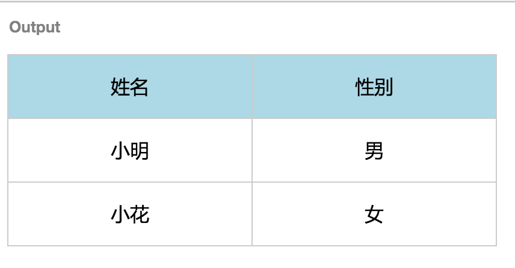

> 课程目标
> 掌握基本标签和基本样式的用法

# 课程任务
## 问答
### line-height有什么作用?

行高，用于调整文字的行间距。

### 如何去查CSS属性的兼容性？比如inline-block哪些浏览器支持？

通过网站 [CanIUse](http://caniuse.com/) 查询兼容性

inline-block 浏览器支持列表:


### a 标签的href, title, target 是什么？ title 和 alt有什么区别？如何新窗口打开链接?

href：链接地址，如 URL 或 URL fragment
title：标签元素的名称信息
target：链接的打开方式，`target="_blank"` 为跳转到新标签

title 和 alt 的区别：
title 属性是一个全局属性，在任何元素上都可以使用，用于提供提示性信息。alt 属性用在 area，input，img 元素上。在图片标签上，title 属性用于鼠标悬停时出现提示信息；alt 用于当图片无法显示时显示与当前图片有关的文本内容。[参考资料](http://stackoverflow.com/questions/13146115/about-the-title-alt-attributes)

新窗口打开链接：现代浏览器默认在新标签打开链接，用户无法通过 HTML 属性值更改跳转方式为新窗口。老式浏览器不支持新标签打开，在 `target="_blank"` 属性值下跳转方式为新窗口。现代浏览器可以通过 javascript 来控制打开方式。但是有可能会被浏览器当作弹窗给阻拦了。

通过 javascript 打开新窗口：

``` html
<a href="http://jirengu.com" onclick="window.open(this.href, 'newwindow'); return false;" onkeypress="window.open(this.href, 'newwindow'); return false;">This link will open in new window/tab</a>
```
另外 jQuery 也可以进行此类操作。

参考资料：
- [Make a link open a new window (not tab)](http://stackoverflow.com/questions/12939928/make-a-link-open-a-new-window-not-tab)
- [Open Link in a New Window](https://css-tricks.com/snippets/html/open-link-in-a-new-window/)
- [Open External Links In New Window](https://css-tricks.com/snippets/jquery/open-external-links-in-new-window/)

### display: none, visibility: hidden, opacity:0 有什么作用？有什么区别？

`display: none;` 元素脱离文档流，不会被渲染，不占位
`visibility: hidden;` 不显示，但在文档中仍然有占空白位，可以点击后面的元素
`opacity: 0;` 设置透明度为零，看不见，但仍然占位，不可以点击后面的元素

参考资料：
- [visibility:hidden vs display:none vs opacity:0](http://stackoverflow.com/questions/14731049/visibilityhidden-vs-displaynone-vs-opacity0)
- [
Does opacity:0 have exactly the same effect as visibility:hidden](http://stackoverflow.com/questions/272360/does-opacity0-have-exactly-the-same-effect-as-visibilityhidden)

### 如何去除 a 链接的默认样式？直接在 a 链接父容器添加颜色，能否继承到当前 a 链接上？

a 元素的默认样式包含：`color` `text-decoration` `cursor` 三个属性。更改三个属性即可去除默认样式。例如：

``` css
a {
    color: black;
    text-decoration: none;
    cursor: point;
}
```

在 a 链接的父容器添加颜色，无法继承到当前 a 链接上。

## 代码题

### 1. 写个div，边框为1px, #ccc, 宽度为200px, 高度为80px, 内有一行文字这里是饥人谷，文字字体大小14px, 颜色#f0f, 文字在div里垂直水平居中

通过 line-height + text-align:center 实现文字垂直水平居中。这种方法只适合单行文字。

``` html
<!doctype html>
<html lang="en">
    <head>
        <meta charset="UTF-8" />
        <title>Document</title>
        <style>
         div {
             border: 1px solid;
             border-color: #ccc;
             width: 200px;
             height: 80px;
             font-size: 14px;
             color: #f0f;
             text-align: center;
             line-height: 80px;
         }
        </style>
    </head>
    <body>
        <div>这里是饥人谷</div>
    </body>
</html>
```

使用表格显示样式

``` css
<style>
div {
    border: 1px solid;
    border-color: #ccc;
    width: 200px;
    height: 80px;
    font-size: 14px;
    color: #f0f;
    text-align: center;
    display: table-cell;
    vertical-align: middle;
}
</style>
```
还有其他多种方法，各有优缺点。

参考资料：
- [CSS布局之-水平垂直居中](http://div.io/topic/1155)
- [CSS实现垂直居中的5种方法](https://www.qianduan.net/css-to-achieve-the-vertical-center-of-the-five-kinds-of-methods/)

### 2. 对于如下html代码

- 给.dialog 加个边框 1px, #ccc
- 给 header 设置高度40px, 左对齐，左内边距10px, 文字16px, 颜色#f00,下边框#ccc 1px。
- 给 content 设置高度100px,内部 a 链接去掉下划线，颜色 blue, 鼠标放置上去后颜色变为 red
- 给 footer 设置高度 50px，内部 btn 设置 边框1px #ccc, 圆角3px, 上下内边距4px,左右内边距3px，显示为inline-block, footer内居中显示;

``` html
<div class="dialog">
    <div class="header">
      <h3>我是标题</h3>
      <a class="close" title="关闭" href="#">X</a>
    </div>
    <div class="content">
          <h3>欢迎来到  <a href="http://jirengu.com">饥人谷</a></h3>
          <p> 在这个大家庭你能快乐的学到更多前端技能</p>
    </div>
    <div class="footer">
        <a class="btn btn-cancel" href="#">取消</a>
        <a class="btn btn-confirm" href="#">确认</a>
    </div>
</div>
```

``` css
<style>

.dialog {
  border: 1px #ccc solid;
}

.header,
.header a {
  height: 40px;
  text-align: left;
  padding-left: 10px;
  font-size: 16px;
  color: #f00;
  border-bottom: #ccc 1px solid;
}

.content {
  height: 100px;
}

h3 a {
  color: blue;
  text-decoration: none;
}

h3 a:hover {
  color: red;
}

div.footer {
  height: 100px;
}

a.btn {
  border: 1px #ccc solid;
  border-radius: 3px;
  padding-top: 4px;
  padding-bottom: 4px;
  padding-left: 3px;
  padding-right: 3px;
  display: inline-block;
  text-align: center;
}

</style>
```

### 3. 写如下表格

表头是蓝色，表行是白色。当鼠标放置到表行时背景色变为淡灰色。

``` html
<!DOCTYPE html>
<html lang="en">
<head>
  <meta charset="UTF-8">
  <title>table</title>
  <style>
    body {
      background: white;
    }
    table {
      border-collapse: collapse;
    }
    thead {
      background: lightblue;
      transition: linear 0.3s;
    }
    thead:hover {
      background: gray;
    }
    tbody {
      background: white;
    }
    td {
      width: 200px;
      height: 50px;
      border: 1px #ccc solid;
      text-align: center;
    }
  </style>
</head>
<body>
  <table>
    <thead>
      <tr>
        <td>姓名</td>
        <td>性别</td>
      </tr>
    </thead>
    <tbody>
      <tr>
        <td>小明</td>
        <td>男</td>
      </tr>
      <tr>
        <td>小花</td>
        <td>女</td>
      </tr>
    </tbody>
  </table>
</body>
</html>
```



### 4. 下面代码有什么作用？手抄一遍如下代码，改变浏览器宽度看看效果

``` html
<!DOCTYPE html>
<html>
<head>
  <meta charset="utf-8">
  <style>
    .wrap{
      width: 900px;
      margin: 0 auto;
    }

  </style>
</head>
<body>
 <div id="header">
   <div class="wrap">这里是标题</div>
 </div>
  <div id="content">
    <div class="wrap">这里是内容</div>
  </div>
<div id="footer">
  <div class="wrap">这里是 footer</div>
</div>
</body>
</html>
```

固定了元素的宽度，垂直外边距为0，水平外边距设置为自动。当宽度大于900px时，左侧会出现留白。
