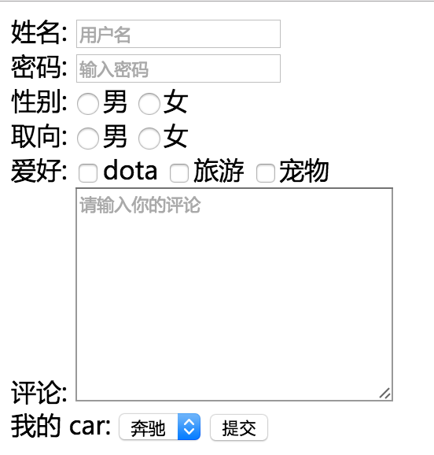

> # 课程目标
>
> 熟悉列表的使用场景和用法
> 理解HTML语义化
> 理解行内元素、块级元素概念
> 熟悉常见input表单的使用方式
> 掌握 POST 与 GET 方式的区别
>
> # 学习建议
> 语义化、行内元素块级元素、POST 和 GET 的区别这是面试必问的知识点

---

# 课程任务 #

## 问答 ##

### 有序列表、无序列表、自定义列表如何使用？写个简单的例子。三者在语义上有什么区别？在哪些情况下使用哪种（重要）？ 如何嵌套？ ###

有序列表：`ol`，HTML Ordered List Element， 项目之间有顺序
无序列表：`ul`，HTML Unordered List Element，并列项目，没有顺序之分
自定义列表：`dt`, HTML Definition Term Element

``` html
<ol>
    <li>有序列表</li>
    <li>有序列表</li>
</ol>
<ul>
    <li>无序列表</li>
    <li>无序列表</li>
</ul>
<dl>
    <dt>自定义列表表头</dt>
    <dd>自定义列表内容</dd>
    <dd>自定义列表内容</dd>
</dl>
```

### 如何去除列表前面的点或者数字？ ###

通过 CSS 的 `list-style: none;` 去除。

### class 和 id 有什么区别？什么时候用 class 什么时候用 id？ ###

id 是设置标签的标识。用于定义一个元素的独特的样式。在同一 HTML 文档中不能有两个具有相同 id 值的元素。文档中的每个 id 值都必须是唯一的。在其他情况下，应该使用class属性。在对页面进行结构化布局时，一般使用 id。id 适用于在页面中仅仅出现一次的情况。

class 是设置标签的类，用于指定元素属于何种样式的类。class 可以将一些元素进行分组。class 可以反复使用。

### 块级元素、行内元素是什么？**有什么区别**？分别对应哪些常用标签？ ###

- 块级元素占据其父元素的整个空间。
- 通常浏览器会在块级元素后另起一个新行。
- 块级元素只能出现在 `<body>` 元素内。

一般块级元素可以包含行内元素和其他块级元素。这种结构上的包含继承区别使得块级元素能够创建更大的结构。块级元素占用空间是整行；行内元素只占据它对应标签的边框所包含的空间。行内元素可以并排显示，块级元素不可以。块级元素可以用样式控制其高、宽的值。而行内元素不能设置宽高。

“块级”的概念在 HTML5 元素中没有明确定义。

类型 | 元素列表
:---|:--------
块级元素 | `div` `p` `h1...h6` `table` `tr` `ul` `li` `dl` `dt` `form` `address` `article` `aside` `audio` `blockquote` `canvas` `dd` `fieldset` `figcaption` `figure` `footer` `header` `hgroup` `hr` `noscript`
行内元素 | `a` `span` `img` `input` `button` `em` `textarea` `b` `big` `i` `small` `tt` `abbr` `acronym` `cite` `code` `cfn` `em` `kbd` `strong` `samp` `var` `bdo` `br` `map` `object` `q` `script` `sub` `sup` `label` `select`

### display: block、display: inline、display: inline-block 分别有什么作用? ###

`dispaly:block` 以块级元素展示；
`display:inline` 以行内元素展示；
`display:inline-block` 具备块级和行内元素特性。

### 下面代码是做什么的？抄写一遍下面的代码，注意 class 和 id 的使用及命名方式 ###

用于创建一个 html5 的页面，包括头部，菜单栏，侧边栏，内容，尾部。

``` html
<!DOCTYPE html>
<html>
<head>
    <meta charset="utf-8">
    <style>
        .wrap {
            width: 900px;
            margin: 0 auto;
        }
    <style>
</head>
<body>
    <div id="header">
        <div class="wrap">
            <a id="logo" href="#"></a>
            <ul class="nav">
                <li><a href="#">导航1</a></li>
                <li><a href="#">导航2</a></li>
                <li><a href="#">导航3</a></li>
            </ul>
        </div>
    </div>
    <div id="content">
        <div class="wrap">
            <div class="aside">侧边栏</div>
            <div class="main">中心区块</div>
        </div>
    </div>
    <div id="footer">
        <div class="wrap">这里是 footer</div>
    </div>
</body>
</html>
`

### 如何理解 HTML CSS 语义化? 在平时写代码的过程中要注意哪些细节？ ###

HTML 语义化

- 选择合适的标签
- 使用合理的代码结构
- 便于开发者阅读
- 有利于浏览器爬虫和机器很好的解析

写 HTML 由大组块到小区块
class 语义化命名

### form 表单有什么作用？有哪些常用的 input 标签，分别有什么作用？ ###

form 表单将用户输入的数据提交到后台，与后台进行数据交互。

input 元素是一个可以满足多种目的的输入控制元素。

`type`：控制显示的类型，默认为文本（`text`）。包括许多其他类型的值，常见的如 `button` `checkbox` `email` `file` `password` `radio` `submit` 等等
`name`：名称控制，随着表单数据一同提交，对应于表单数据的域名称
`checked`：如何 `type` 属性的值为 `radio` 或 `checkbox`，该属性值决定该项目是否默认被选中。
`inputmode`：键盘输入字符类型
`radio`：选择按钮，用于单选或者多选

### post 和 get 方式的区别？ ###

post 方法：表单数据随同表单一起发送给服务器；
get 方法：默认为 get；表单数据被添加到 action 属性的 URL 后，并将构成的 URL 发送给服务器；这种方法要避免存在副作用的情况，数据量大不适合，并且只能包含 ASCII 字符。

两者的差别：
- get 把参数包含在 URL 中，post 通过 request body 传递参数
- get 在浏览器回退时是无害的，而 post 会再次提交请求
- get 产生的 url 地址可以被添加到书签，而 post 不可以
- get 请求会被浏览器主动 cache，而 post 不会，除非手动设置
- get 请求只能进行 url 编码，而 post 支持多种编码方式
- get 请求参数会被完整保留在浏览器历史记录里，post 中的参数不会被保留
- get 请求在 url 中传送的参数是有长度限制的，而 post 没有
- 对参数的数据类型，get 只接收 ascii 字符，而 post 没有限制
- get 相比 post 较不安全，因为参数直接暴露在 url 上，所以不能用来传递敏感信息
- get 参数通过 url 传递，post 放在 request body 中
- get 产生一个 TCP 数据包；post 产生两个 TCP 数据包

事实上，get 和 post 本质上就是 TCP 链接，并无差别。由于 HTTP 的规定和浏览器/服务器的限制，导致他们在应用过程中体现一些不同。

参考资料：

[99%的人都理解错了HTTP中GET与POST的区别](http://mp.weixin.qq.com/s?__biz=MzI3NzIzMzg3Mw==&mid=100000054&idx=1&sn=71f6c214f3833d9ca20b9f7dcd9d33e4#rd)

### 在 input 里，name 有什么作用？ ###

- 用于传递给网站服务器（而不是数据库）表单的某表单域信息。
- 在使用 radiobutton 时，name 可用于分组，实现单选功能。

### <button> 提交 </button>、<a class="btn" href="#">提交</a>、<input type="submit" value="提交"> 三者有什么区别？ ###

`<button>提交</button>` 文字为提交的按钮，并不提交数据
`<a class="btn" href="#">提交</a>` 文本为提交的超链接，跳转链接，但不提交数据
`<input name="submit" value="提交" />` 提交数据

### radio 如何分组? ###

单选框，通过相同的 name 属性进行分组，只能单选。name 不相同则可以多选。

### placeholder 属性有什么作用? ###

用于提示用户在输入框可以输入什么样的信息。placeholder 不能包含回车或换行符。

### type=hidden 隐藏域有什么作用? 举例说明 ###

暂存数据。安全校验。传递参数。

> hidden隐藏域无外乎下面六点作用：
>
> * 隐藏域在页面中对于用户是不可见的，在表单中插入隐藏域的目的在于收集或发送信息，以利于被处理表单的程序所使用。浏览者单击发送按钮发送表单的时候，隐藏域的信息也被一起发送到服务器。
> * 有些时候我们要给用户一信息，让他在提交表单时提交上来以确定用户身份，如sessionkey，等等．当然这些东西也能用cookie实现，但使用隐藏域就简单的多了．而且不会有浏览器不支持，用户禁用cookie的烦恼。
> * 有些时候一个form里有多个提交按钮，怎样使程序能够分清楚到底用户是按那一个按钮提交上来的呢？我们就可以写一个隐藏域，然后在每一个按钮处加上onclick="document.form.command.value="xx""然后我们接到数据后先检查command的值就会知道用户是按的那个按钮提交上来的。
> * 有时候一个网页中有多个form，我们知道多个form是不能同时提交的，但有时这些form确实相互作用，我们就可以在form中添加隐藏域来使它们联系起来。
> * javascript不支持全局变量，但有时我们必须用全局变量，我们就可以把值先存在隐藏域里，它的值就不会丢失了。
> * 还有个例子，比如按一个按钮弹出四个小窗口，当点击其中的一个小窗口时其他三个自动关闭．可是IE不支持小窗口相互调用，所以只有在父窗口写个隐藏域，当小窗口看到那个隐藏域的值是close时就自己关掉

## 代码 ##

### 写出如下form表单，性别和取向是单选，爱好是多选 ###

``` html
<!doctype html>
<html lang="en">
    <head>
        <meta charset="UTF-8" />
        <title>Document</title>
    </head>
    <body>
        <form action="#" method="post">
            姓名:
            <input name="name" type="text" placeholder="用户名"/><br />
            密码:
            <input name="passwd" type="password" placeholder="输入密码"/><br />
            性别:
            <input name="sex" type="radio" value="male" />男
            <input name="sex" type="radio" value="female" />女 <br />
            取向:
            <input name="sex-orientation" type="radio" value="male" />男
            <input name="sex-orientation" type="radio" value="female" />女 <br />
            爱好:
            <input name="hobby" type="checkbox" value="dota" />dota
            <input name="hobby" type="checkbox" value="travel" />旅游
            <input name="hobby" type="checkbox" value="pet" />宠物 <br />
            评论:
            <textarea cols="30" id="" name="comment" rows="10" placeholder="请输入你的评论"></textarea><br />
            我的 car:
            <select name="car">
                <option value="benz">奔驰</option>
                <option value="bmw">宝马</option>
                <option value="honda">本田</option>
            </select>
            <input name="submit" type="submit" value="提交" />
        </form>
    </body>
</html>

```



---

难点：

块级元素和行内元素
HTML 语义化
div 使用

---

参考

- [The Difference Between “Block” and “Inline”](https://www.impressivewebs.com/difference-block-inline-css/)
- [CSS display: inline vs inline-block](http://stackoverflow.com/questions/9189810/css-display-inline-vs-inline-block)
- [What is the difference between display: inline and display: inline-block?](http://stackoverflow.com/questions/8969381/what-is-the-difference-between-display-inline-and-display-inline-block)
- [html hidden隐藏域作用及用法实例介绍](http://www.manongjc.com/article/1019.html)
