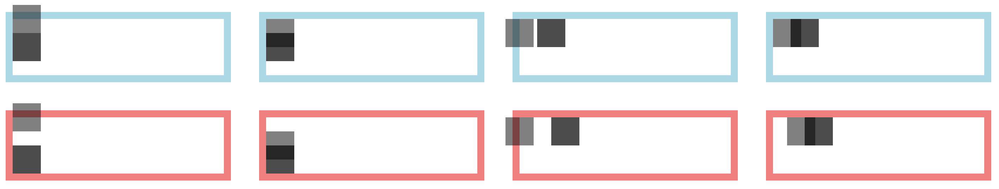

# 问题 #

## 负边距在让元素产生偏移时和 position: relative 有什么区别? ##

首先这是两个不同的属性，目的不一样。边距是盒模型中的一个部分，表示的是元素之间的距离。当一个元素的边距负偏移时，那么相应的同一个容器内的同级元素也会发生偏移。相对定位本身就是用来布局的，其偏移的位置是相对于最近一级的父级的块级元素。所以当元素通过相对定位来偏移时，容器内的其他元素并不会因此而改变位置。从下面这幅示例图可以看出来。

有个有意思的地方是，当元素偏移的边缘没有靠近父容器边缘时，感觉不出来元素有偏移，但是其同级元素与偏移元素之间发生了相对位置变化。也就是说，负边距偏移是相对于相邻的元素的边缘的偏移。

[Codepen](http://codepen.io/lix90/pen/edwXNo)

## 使用负 margin 形成三栏布局有什么条件? ##

- 中间一栏自适应；
- 左右永远固定；
- 中间一栏最先渲染；
- 允许任意一栏放最上面；
- 需要一个额外的 div 标签；

参考资料：

- [我熟知的三种三栏网页宽度自适应布局方法](http://www.zhangxinxu.com/wordpress/2009/11/%E6%88%91%E7%86%9F%E7%9F%A5%E7%9A%84%E4%B8%89%E7%A7%8D%E4%B8%89%E6%A0%8F%E7%BD%91%E9%A1%B5%E5%AE%BD%E5%BA%A6%E8%87%AA%E9%80%82%E5%BA%94%E5%B8%83%E5%B1%80%E6%96%B9%E6%B3%95/)
- [HTML+CSS实现两栏和三栏布局](http://www.jianshu.com/p/5b12cc678130)

## 圣杯布局的原理是怎样的? 简述实现圣杯布局的步骤 ##

圣杯布局是一个典型的三栏布局，主要是利用负边距和浮动构建。左右边栏的宽度固定，中间自适应。中间一栏要在 html 中先出现。圣杯布局需要增加一个额外的 `div` 容器包裹住三个元素，三个元素均左浮动。实现步骤为以下：

1. 建立框架：`header`, `container`, `footer`；在 `container` 元素内加入三栏元素：顺序为 `center` `left` `right`；
2. 设置 `container` 的内边距；消除 `footer` 浮动。
3. left 和 right 固定宽度，center 宽度为 100%；三个元素均为左浮动；
4. 移动左侧栏到最左端：利用 `margin-left: -100%`，相对定位，向左偏移元素宽度；
5. 移动右侧栏到最右端：设置负外边距的宽度为元素宽度，相对定位，向右偏移元素宽度；

参考资料：

- [In Search of the Holy Grail](http://alistapart.com/article/holygrail)
- [关于「圣杯布局」](https://segmentfault.com/a/1190000004524159)

## 双飞翼布局的原理? 实现步骤? ##

双飞翼布局原理和圣杯布局类似，只不过对中间元素加了一个 `div` 并设置其左右外边距，从而防止左右两栏覆盖掉内容。

1. 建立框架：`header` `container` `footer`
2. 在 `container` 加入三栏：先 `center` 后 `left` 最后 `right`；
3. 在 `center` 内部添加子元素；
4. 设置 `center` `left` `right` 为左浮动，`center` 宽度为 100% 覆盖整个容器宽度；left 和 right 为固定宽度；
5. 设置 `left` 和 `right` 元素的负边距，`left` 为 -100%，`right` 为元素自身的宽度；
6. 设置 `center` 子元素的外边距；

# 代码 #

1 用浮动、负边距实现如下效果

[Codepen](http://codepen.io/lix90/pen/KgOype)

2 使用圣杯布局实现如下三栏布局 (两侧固定宽度200px,中间自适应)

[Codepen](http://codepen.io/lix90/pen/xEvPBE)

3 使用圣杯布局的思路实现如下两栏布局

[Codepen](http://codepen.io/lix90/pen/BLXJqX)

4 使用双飞翼布局实现如下三栏布局 (两侧固定宽度200px,中间自适应)

[Codepen](http://codepen.io/lix90/pen/BLXJea?editors=1100)

5 使用双飞翼布局的思路实现如下两栏布局

[Codepen](http://codepen.io/lix90/pen/YGmeyM?editors=1100)

